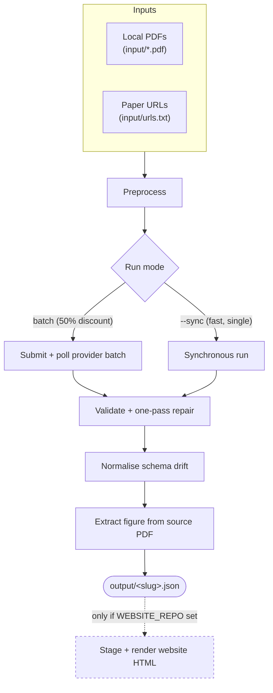

# explainer-batch

Turn research PDFs into structured JSON explainer articles using the Claude or
OpenAI batch/sync APIs.

- **Input:** local PDFs and/or a list of paper URLs.
- **Output:** one `output/<slug>.json` per paper — a validated, schema-stable
  explainer object — plus an optional self-contained `output/<slug>.html`.
- **Cost:** uses the Claude Message Batches API / OpenAI Batch API (50%
  discount) or a synchronous path for fast single runs.
- **Determinism:** model schema drift is normalised after generation; figures
  are extracted from the source PDF deterministically, never hallucinated.

## What this is / is not

- It **is** a focused pipeline that produces a specific JSON schema
  (`src/types/explainer-json.ts`) intended for a separate React renderer.
- It is **not** a general-purpose PDF summariser or chat tool.
- Figure extraction is **macOS-first**: it shells out to `sips`. On Linux the
  pipeline still runs but `image` blocks are dropped (see Troubleshooting).
- The website integration is **optional**. Without it you still get JSON.

## Architecture



Claude and OpenAI are both supported as the provider; the website step (`S`) is
entirely optional.

## Prerequisites

- **Node 20+** (`.nvmrc` pins 20; `package.json` enforces `engines`).
- **One provider credential** — an Anthropic or OpenAI API key, a Claude
  Max/Pro OAuth token, or Codex CLI auth (see Auth routes).
- **poppler** — `pdftotext`, `pdftoppm`, `pdfimages`, `pdfinfo`, used for
  figure extraction. `brew install poppler` / `apt-get install poppler-utils`.
- **`sips`** — ships with macOS; used to downscale extracted figures. Not
  available on Linux: figures are skipped there, the rest of the pipeline is
  unaffected.
- **tmux** — only required for the secure headless route
  (`npm run process:secure:tmux`).

## Quick start (no 1Password — primary path)

```bash
npm install
cp .env.example .env
# edit .env: set ANTHROPIC_API_KEY and/or OPENAI_API_KEY

# Provide input as a local PDF...
cp ~/Downloads/my-paper.pdf input/
# ...and/or paper URLs (arXiv, DOI, publisher page, or direct PDF link):
echo "https://arxiv.org/pdf/2411.13768" >> input/urls.txt

# Claude batch (50% discount, ~1h turnaround):
npm run process -- --provider claude

# or OpenAI batch:
npm run process -- --provider openai

# or a fast synchronous run (Claude OAuth or Codex CLI auth, no batch wait):
npm run process -- --provider openai --sync
```

`.env` is loaded **fill-only** (`src/env.ts`): a value there is used only if the
variable is not already set, so it never overrides a real shell export or a
1Password-injected key.

Generated JSON lands in `output/` (or `EXPLAINER_OUTPUT_DIR`). **No website
repo is required** — staging and website-HTML export are skipped unless
`WEBSITE_REPO` is set.

## Quick start (with 1Password — optional)

For non-interactive/headless runs without putting keys in `.env` or your shell:

```bash
cp op-refs.local.sh.example op-refs.local.sh
# edit op-refs.local.sh with your real op:// vault refs

npm run process:secure:tmux                 # default provider: openai
PROVIDER=claude npm run process:secure:tmux # Claude batch
```

`scripts/run-batch-tmux.sh` sources `op-refs.sh`, resolves **only** the key the
selected route needs via an `op-fetch` resolver on `PATH`, and runs the child
in a detached tmux session with a sanitised environment. If `op-fetch` or
`op-refs.local.sh` is absent it falls back to running directly with `.env`.

## Commands

| Command | What it does |
|---|---|
| `npm run process` | Full pipeline: preprocess → submit batch → poll → save JSON (+ optional HTML) |
| `npm run submit` | Preprocess + submit batch, then exit (prints batch ID) |
| `npm run poll` | Poll the latest pending batch and save results when ready |
| `npm run poll -- <batch-id>` | Poll a specific batch by ID |
| `npm run status` | Show all batches, per-request results, token counts |
| `npm run process -- --sync` | Run synchronously (no batch queue) |
| `npm run export-html -- --input-dir output` | Re-render HTML from existing JSON (needs `WEBSITE_REPO`) |
| `npm run typecheck` / `npm run build` | Type-check / compile to `dist/` |
| `npm run guards:install` | Arm the local publish git hooks (contributors) |

Always pass `--provider claude` or `--provider openai` explicitly. With no flag
and no `PROVIDER` env var the default is `claude`.

## Inputs

- **Local PDFs** — drop any `.pdf` into `input/`. OpenAI uploads are cached in
  `state.json` by filename + content hash; unchanged files are reused.
- **Remote URLs** — `input/urls.txt`, one HTTP(S) link per line (`#` comments
  ignored).
- **Per-paper focus hint (optional)** — steer emphasis for one paper without
  changing the global prompt:
  - PDF: sidecar `input/<basename>.focus.md` (body = emphasis block).
  - URL: append `# focus: …` to the line in `urls.txt`.
- **Lead-image override (optional)** — force a specific figure as the lead
  image via directive lines in the focus content (stripped before the model
  sees the prose):

  ```
  image: Figure 3.0
  image_caption: Source (2026), Figure 3.0. Annual spend by firm type.
  image_alt: Bar chart comparing spend brackets.
  ```

## Configuration

All variables are optional except a provider credential. Set them in `.env`,
`.env.local`, or the shell.

| Variable | Purpose | Default |
|---|---|---|
| `ANTHROPIC_API_KEY` | Claude batch / API | — |
| `OPENAI_API_KEY` | OpenAI batch / API | — |
| `CLAUDE_CODE_OAUTH_TOKEN` | Claude Max/Pro sync route | — |
| `PROVIDER` | Default provider when no `--provider` flag | `claude` |
| `MODEL_BATCH` `MODEL_LANE` `MODEL_SYNTHESIS` `MODEL_REPAIR` | Per-stage model overrides | see below |
| `MAX_TOKENS` `LANE_MAX_TOKENS` `SYNTHESIS_MAX_TOKENS` `REPAIR_MAX_TOKENS` | Per-stage token caps | see below |
| `EXPLAINER_INPUT_DIR` | Where source PDFs / `urls.txt` / focus sidecars are read | `<repo>/input` |
| `EXPLAINER_OUTPUT_DIR` | Where JSON is written | `<repo>/output` |
| `WEBSITE_REPO` | Consuming website repo; enables staging + website HTML | unset (skipped) |
| `EXPLAINER_JOBS_DIR` | Shared batch-dashboard jobs dir (best-effort) | `<repo>/jobs` |

Model defaults — Claude: batch/lane/synthesis `claude-opus-4-7`, repair
`claude-sonnet-4-6`. OpenAI: batch/synthesis `gpt-5.4`, lane/repair
`gpt-5.4-mini`. For a committed profile, copy `config/models.json.example` to
`config/models.json` (gitignored; env vars still win over the file).

### Auth routes

| Route | Credential | Notes |
|---|---|---|
| Claude batch | `ANTHROPIC_API_KEY` | 50% discount, ~1h turnaround |
| Claude sync | `CLAUDE_CODE_OAUTH_TOKEN` | Max/Pro quota; mixed OAuth+API-key env is rejected |
| OpenAI batch | `OPENAI_API_KEY` | semantic-lane extraction + synthesis |
| OpenAI sync | Codex CLI auth (no key fetched) or `OPENAI_API_KEY` | fast single runs, no batch wait |

1Password is optional and orthogonal to the route — see *Quick start (with
1Password)* and `docs/SECURITY.md`.

## How it works

1. **Preprocess** — read local PDFs and the optional URL list.
2. **Submit** — Claude: one explainer request per paper. OpenAI: semantic lane
   extraction (`methods/results/limitations/implications`) with a smaller lane
   model.
3. **Poll** — exponential backoff (30 s → 5 min cap) until the batch ends
   (skipped for `--sync`).
4. **Synthesis + save** — OpenAI runs a second synthesis stage; all providers
   get validation + an optional one-pass repair, then:
   - **`normalizeSchemaDrift`** derives canonical `paragraphs` and
     `end_takeaway.label/body` when the model emits `*_html`/`heading`
     variants, so the renderer never shows blank blocks.
   - **`attachFigureImage`** applies any lead-image override, then
     deterministically locates the named figure in the source PDF (poppler +
     `sips`), re-encodes to a downscaled JPEG, and inlines it as a base64 data
     URL. Failures drop the image block silently — the explainer still renders.
   - JSON is written to the output dir; if `WEBSITE_REPO` is set it is also
     staged and rendered to standalone HTML.

The system prompt is `skill.md` (after its YAML frontmatter) sent verbatim.

## Website integration (optional)

Only relevant if you set `WEBSITE_REPO` to a checkout of the consuming
website repo. When set, every saved JSON is copied into that repo's
`explainers-new/` staging dir, and `html-export.ts` spawns its
`scripts/export-explainer-html.mts` to write a self-contained HTML file next to
the JSON (Chart.js from CDN, no Next.js runtime dependency). `output/*.html`
opens directly in a browser for a pixel-accurate preview.

**Shared type contract:** `src/types/explainer-json.ts` here must stay in sync
with the website repo's equivalent `ExplainerJson` type. Any schema change must
land in both repos.

## Troubleshooting

| Symptom | Cause / fix |
|---|---|
| `Website HTML export skipped (WEBSITE_REPO not set)` | Expected when not using the website integration. Not an error. |
| Image silently dropped | poppler not installed, or on Linux (`sips` is macOS-only), or the named figure was not found in the PDF. |
| `JSON parse failed — raw output saved to *_error.txt` | Model returned non-JSON; inspect the `.txt` in the output dir. |
| Claude run rejected for mixed auth | Both `CLAUDE_CODE_OAUTH_TOKEN` and `ANTHROPIC_API_KEY` were set for a sync run. Use the secure tmux route or unset one. |
| `op-fetch is not installed` | Not fatal — the secure wrapper falls back to `.env`. Only the 1Password route needs `op-fetch`. |

## Development

```bash
npm run typecheck      # tsc --noEmit
npm run build          # compile to dist/
npm run guards:install # arm local publish hooks (one-time, per clone)
```

`state.json` is auto-managed — do not hand-edit. Agent guidance lives in
`AGENTS.md`; Claude Code specifics in `CLAUDE.md`. The private-work →
public-mirror branching/publish model is documented in
`docs/PUBLISH-WORKFLOW.md`.

## Security

Credentials are never committed. The `.env`/`.env.local` loader is fill-only;
the 1Password route resolves only the keys a route needs and runs the child
with a sanitised environment; committed `op-refs.sh` holds placeholders while
real refs live in a gitignored `op-refs.local.sh`. Local git hooks
(`scripts/install-guards.sh`) block machine-specific data from being committed.
See `docs/SECURITY.md`.

## License

MIT — see `LICENSE`.
